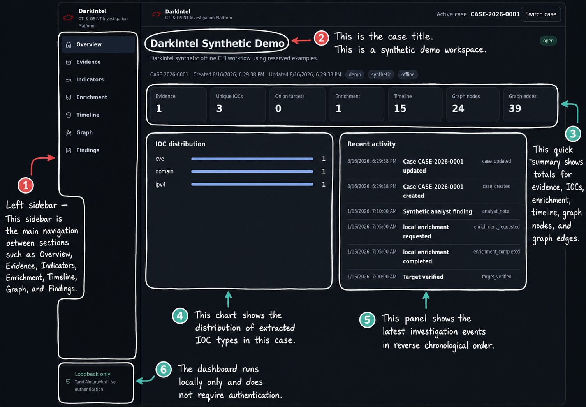
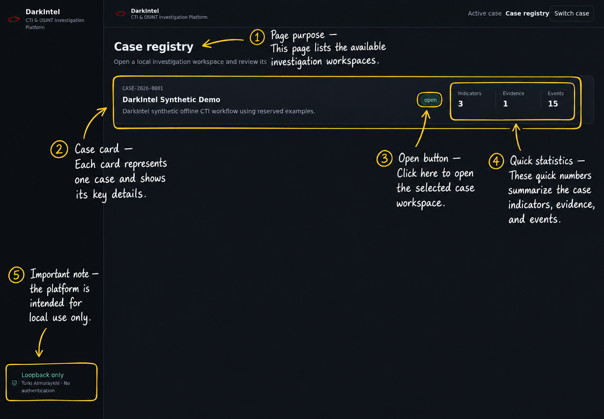
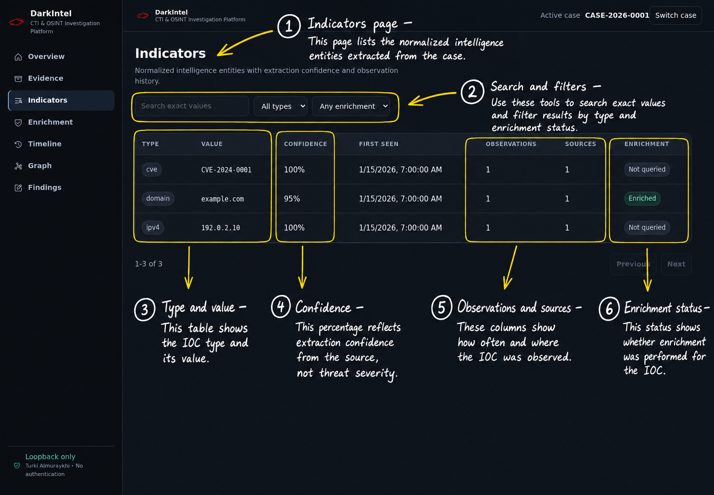
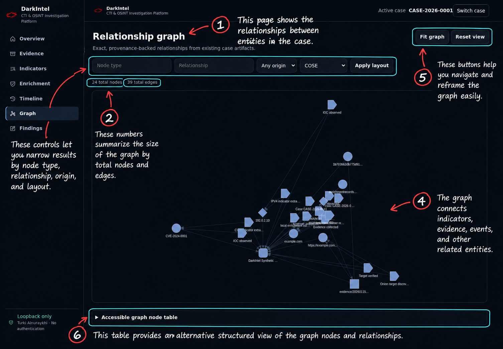
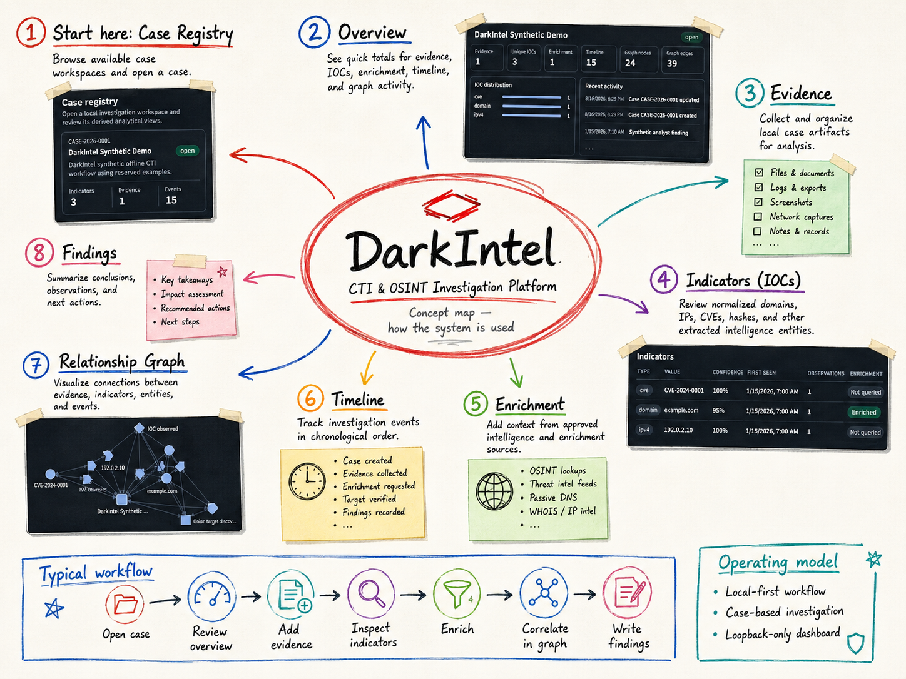

# Kali Linux validation

DarkIntel was exercised on Kali Linux on 2026-08-16 using a deterministic,
offline synthetic investigation case.

> **Validation provenance:** the retained package identifies commit
> `299dd82ae48dc196458a0dacb96e61843f331d0b` as the reviewed base, but it does
> not preserve the exact final commit containing two validation-time fixes.
> The exact Kali release was also not recorded. The results below document the
> observed validation session; repeat the suite on a commit-pinned tree before
> treating this as release attestation.

## Environment

| Component | Validated value |
|---|---|
| Kali Linux release | Not recorded in the retained validation package; revalidation required |
| Reviewed base commit | `299dd82ae48dc196458a0dacb96e61843f331d0b` |
| Exact final tested commit | Not retained; the validation tree included the two post-commit adjustments described below |
| Python | 3.13.12 |
| Node.js | 24.18.0 |
| npm | 11.16.0 |
| Tor | 0.4.9.11 |
| Chromium | Kali system Chromium, headless rendering |
| Tor SOCKS listener | `127.0.0.1:9050` |
| Dashboard listener | `127.0.0.1:8000` only |

No privileged system changes were reported.

## Validation results

### Python

The Kali session reported the following final results from its virtual environment:

```text
.venv/bin/python -m compileall -q darkintel dashboard main.py tests  PASS
.venv/bin/python -m ruff check darkintel dashboard main.py tests    PASS
.venv/bin/python -m pyright                                         PASS (0 errors, 0 warnings)
.venv/bin/python -m pytest -q                                       PASS (175 tests)
```

Pyright and Pytest required local subprocess/socket access because the validation
sandbox otherwise prevented virtual-environment discovery and in-process dashboard
transport. The tests were configured not to contact live providers or Tor.

### Frontend

The locked frontend install and validation gates reported:

```text
npm ci                 PASS (167 packages, 0 reported vulnerabilities)
npm run typecheck      PASS
npm test               PASS (1 file, 5 tests)
npm run build          PASS (Vite production build)
```

### Tor and dashboard boundary

`main.py tor-check --tor-host 127.0.0.1 --tor-port 9050 --timeout 2`
reported `available: true`. This establishes only that the configured SOCKS
listener was reachable; it does not prove anonymity or validate a Tor circuit.

The non-loopback dashboard command failed closed before Uvicorn startup:

```text
.venv/bin/python main.py dashboard --host 0.0.0.0 --port 8000
dashboard host must be loopback because authentication is not implemented
```

The live health endpoint reported `status: ok`, `product: DarkIntel`, an
accessible cases root, and an available frontend build. `ss` reported the
listener as:

```text
LISTEN 127.0.0.1:8000
```

The validation server was stopped after the screenshots were captured.

### Linux launcher

The launcher suite reported `7 passed`, covering relocatability, unprivileged
user-local installation, safe uninstall, existing-server reuse, port-conflict
handling, missing-environment diagnostics, and preservation of an existing
listener. Shell syntax validation was also reported as passing for the launcher,
installer, and uninstaller.

## Validation-time findings

The session identified two changes made after the reviewed base commit:

1. The missing-npm launcher test required a genuinely isolated `PATH` and an
   absolute resolved Bash path so Kali's `/usr/bin/npm` could not leak into the test.
2. The dashboard launcher needed to propagate the CLI-selected cases directory to
   the backend loaded by Uvicorn through `DARKINTEL_CASES_DIR`.

The retained package does not identify a commit containing these changes. They are
therefore documented as validation findings, not as capabilities proven to exist in
the reviewed base commit.

## Known limitations

- The exact Kali release was not captured.
- The final tested working tree was not pinned to a retained Git commit.
- Reported test counts apply to that temporary Kali validation tree, not necessarily
  to the reviewed base commit.
- Tor validation confirms listener reachability only, not circuit routing or anonymity.
- The dashboard is unauthenticated and is intended for loopback-only operation.
- Screenshots demonstrate the synthetic workflow but do not independently prove the
  host operating-system or tool-version claims.

## Original validation screenshots

These unannotated PNGs are the original validation evidence captured at 1440x1000.
They are retained separately from the explanatory walkthrough images.

- [Case registry](screenshots/cases.png)
- [Synthetic case overview](screenshots/case-overview.png)
- [Synthetic indicators](screenshots/indicators.png)
- [Synthetic relationship graph](screenshots/graph.png)

SHA-256 checksums:

```text
0dd73d999866dc52b03253f5281561b378db4ced93fc1136657a4b2b8d7c3369  case-overview.png
a8e5b2694c04334c9a8d3e5034278acc4dc01728bbc411fc5e305df6f996e49f  cases.png
2eebb71a7bce9290a14c8773e1b83aec9ae4f9f8a642776061fd1f3d2f6c8303  graph.png
a89909ae5945e0d4b283ce408fb7bcf0baebd428569028546471307eade2ca92  indicators.png
```

## Interface Walkthrough

The images in this section are annotated explanatory derivatives. They help readers
understand the interface and are not substitutes for the original validation evidence.

### Overview

The Overview page summarizes evidence, extracted IOCs, enrichment activity,
timeline events, and relationship-graph statistics for the current case.



### Case Registry

The Case Registry lists local investigation workspaces and their evidence,
indicator, and event totals.



### Indicators

The Indicators page presents normalized IOCs, extraction confidence, observations,
sources, and enrichment status.



### Relationship Graph

The Relationship Graph connects case artifacts through provenance-backed nodes and
edges and provides an accessible structured-table fallback.



## DarkIntel Investigation Workflow

The following concept map is an explanatory graphic, not runtime validation evidence.



*DarkIntel concept map showing the typical investigation workflow from opening a
case through evidence review, IOC analysis, enrichment, graph correlation, and
findings.*

## Synthetic-data and privacy statement

All screenshot and demo content is synthetic. Visible examples use the reserved
domain `example.com`, documentation address `192.0.2.10`, synthetic identifier
`CVE-2024-0001`, case `CASE-2026-0001`, and the title `DarkIntel Synthetic Demo`.
No real case, provider, onion-service, credential, victim, or analyst evidence is
included.
